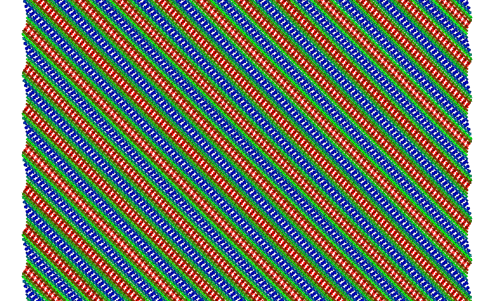

Finite temperatures
===================

Statistics
----------
In this exercise we will investigate how statistics affect simulated measurables.

A single spin with an uniaxial anisotropy has a bi-stable, Ising like, magnetic state. At finite temperatures the stability of the magnetic state is not finite
but follows an exponential (Arrhenius) relaxation behaviour. As seen in the lecture, ensemble averaging can be crucial for the analysis of such systems.

 * Investigate the amount of statistics that is needed to say something relevant about the life time of the magnetic state of the system. 
 
 * Does the need of statistics change with system parameters? (temperature, anisotropy, external field)

 * Extra: Can you fit the relaxation behaviour to an `Arrhenius function <https://en.wikipedia.org/wiki/Arrhenius_equation>`_? 

You can do a similar analysis for a finite 1d-chain by either modifying the single spin example, or 
starting from the `SimpleSystems/HeisChain <https://github.com/UppASD/UppASD/tree/master/examples/SimpleSystems/HeisChain>`_ example.

 * Is there a difference by performing ensemble averaging compared to just increasing the system size?

 * Does the exchange interaction magnitude affect the stability of the spin chains?

An accessible article for those interested in spin chains and statistics can be found here: `A. Vindigni Inorganica Chimica Acta, 361 3731 (2008) <https://www.sciencedirect.com/science/article/abs/pii/S0020169308001588>`_.

Thermalization
--------------
In this exercise the thermalization rates in spin simulations will be investigated. 

As mentioned in the lecture, thermalising the system before performing measurements is crucial for ensuring relevant results. 
Here we will investigate this for a simple cubic model system.

The initial ``inpsd.dat`` file looks as follows 

.. literalinclude:: SimpleCubic/inpsd.dat

and the almost trivial ``posfile`` and ``momfile`` are written as 

.. literalinclude:: SimpleCubic/posfile
.. literalinclude:: SimpleCubic/momfile

The ``jfile``, that will be changed during the exercise initially can look like

.. literalinclude:: SimpleCubic/jfile

i.e. including nearest and next-nearest neighbours on the cubic lattice. Notice that since ``sym 1`` is given in ``inpsd.dat``, the ``jfile`` can be kept to a minimum of two lines.

 * Starting with the inputs as defined above, vary the simulation method and damping (where applicable) to investigate the thermalization rate of the system.

 * Is the thermalization faster when going from low to high temperatures or vice versa? Anything particular happening around Tc?

 * Change the sign of the next-nearest neighbour and redo the study. Is the magnetization a good measurable for determining the thermalization now?

Phase diagrams
--------------
Obtaining the M vs T relationship is probably the most common use case for Monte Carlo simulations on spin systems. 
In this exercise you can compare the MC functionalities of UppASD with a the ALPS package. 

The system in question is here the 2d square lattice with NN exchange couplings. 
To compare with other model implementations this example uses the ``aunits Y`` flag which sets the temperature unit to the exchange strength ``J`` instead of Kelvin.

The ``inpsd.dat`` will here look as follows (to start with). Note the **TEMP** entries for initial and measurement temperatures.

.. literalinclude:: SquareLattice/Base/inpsd.dat

and the ``posfile`` and ``momfile``, and ``jfile`` files looks as 

.. literalinclude:: SquareLattice/Base/posfile
.. literalinclude:: SquareLattice/Base/momfile
.. literalinclude:: SquareLattice/Base/jfile

Again, note that with ``aunits Y`` the exchange interaction in ``jfile`` is not defined in ``mRy`` but in the dimensionless energy scale of ``J`` (which is not Joule either).

In order to obtain the full M(T) curve, several simulations are needed at consecutive temperatures. 
This is preferably scripted, like in this example where we use a simple ``bash`` script ``runme.sh``

.. literalinclude:: SquareLattice/runme.sh

Here you either need to replace the ``${SD_BINARY}`` expression, or export the location of your UppASD binary as the environment variable with the same name.
You also need to use the same directory structure as intended, i.e. put the input files in a directory called `Base` and the ``runme.sh``
script in the directory below. 

 * Run the script and plot the resulting M(T) curve. 

 * Compare with the reference data in the :download:`sc_64_ALPS.dat <SquareLattice/sc_64_ALPS.dat>` file

 * Are the simulation parameters "good enough" or are more thermalization/sampling steps needed to obtain an accurate M(T) curve?

Minimization
------------

Ground state determination is another situation where Monte Carlo and Atomistic spin dynamics simulations are used extensively. 
For isotropic ferromagnets this is usually a trivial task but for systems with exchange frustration and/or strongly anisotropic systems
the ground state search can prove quite demanding.

In this exercise you will examine different kinds of magnetic systems with the task of finding their respective ground states.

Anisotropic systems
^^^^^^^^^^^^^^^^^^^

The first example starts from the square lattice of the previous exercise, but this time we will add a uniaxial anisotropy to the system.
Copy the input files from the previous exercise and add a uniaxial anisotropy with a strength of ``0.4J`` , where ``J`` still is the 
dimensionles unit of energy as earlier. An anisotropy is added by including the keyword ``anisotropy ./kfile`` to ``inpsd.dat`` and
creating the anisotropy file ``kfile`` as per below. Also start with the ``jfile`` that only had positive exchange couplings.

.. literalinclude:: SquareAniLattice/kfile

Note that you can give all input files besides ``inpsd.dat`` more descriptive names if wanted.

 * With the anisotropy included, simulate the system starting from the ferromagnetic configuration by using ``initmag 3`` and relax the system to a temperature approaching zero. You can visualize the structure using the GUI, or if it fails to run with the ``ASD_Tools/myRestart3.py`` script provided in the Github repository. :download:`< myRestart3.py <https://raw.githubusercontent.com/UppASD/UppASD/master/ASD_Tools/myRestart3.py>`

This should give you a ferromagnetic order of the full sample, as expected. 

 * Now change the starting guess to a fully disordered state by using ``initmag 1`` and redo the relaxation. What state do you end up with?

The anisotropies in the system causes large energy barriers that can not be overcome at low temperatures.
So unless the starting guess is good there is a risk that one ends up in a local minimum instead of the global one.
To overcome these barriers one can employ higher temperatures which is typically done with the "Simulated annealing" (SA) approach, 
where one performs consecutive initial phase runs, starting from a high temperature and gradually reducing the temperature to the target value.

In UppASD, this is preferably done using the ``ip_mcanneal`` or ``ip_nphase`` constructs. An example is seen below.

.. literalinclude:: SquareAniLattice/mcanneal.snippet

There are no global recipies for the optimal number if anneal sweeps and the temperature distibution so here empirical experience is your friend.

 * Try different SA sequences and see if you can relax the anisotropic system to its ferromagnetic ground state.

Dzyalosinskii-Moriya systems
^^^^^^^^^^^^^^^^^^^^^^^^^^^^

Also without anisotropy, ground state relaxation can prove a formidable task.

.. literalinclude:: ChiralSpiral/inpsd.dat

and the ``posfile``, ``jfile``, ``momfile`` as below

.. literalinclude:: ChiralSpiral/posfile
.. literalinclude:: ChiralSpiral/jfile
.. literalinclude:: ChiralSpiral/momfile

Now we also have a Dzyaloshinskii-Moriya (DM) file ``dmfile`` that looks like 

.. literalinclude:: ChiralSpiral/dmfile

where the first five columns are the same as for a regular ``jfile`` i.e. atom sites and distance vector :math:`\mathbf{R}_{ij}`. 
The remaining three columns define the DM interaction vector :math:`\mathbf{D}_{ij}`. This system with ferromagnetic exchange and significant
DM interactions has a spin-spiral ground state as shown below.

Fig. 1 Spin spiral ground state for a DM system.

 * For this setup, start from a random configuration with ``initmag 1`` and relax the structure. What end state do you get?
 
 * If you do not get the spiral state, try to obtain it with simulated annealing. How close can you come? Is the energy stabilizing?

Glassy systems
^^^^^^^^^^^^^^

As a final challenge, lets consider a spin glass system. 
A simple yet illustrative model for a spin glass system is given by the Edwards-Anderson model, where a nearest neighbour Hamiltonian on a cubic 
lattice, but with random exchange interactions are used. 

The UppASD code can model Edwards-Anderson spin glasses by the keywords ``ea_model T`` and ``ea_sigma XX`` where ``ea_sigma`` contols
the width of the Gaussian distribution of the randomized exchange interactions. Disregarding the ``ea_sigma`` keyword for now, 
we can define a simple cubic system with randomized exchange with the following ``inpsd.dat``

.. literalinclude:: EdwardsAnderson/inpsd.dat

While the ``posfile`` and ``momfile`` are made as easy as possible

.. literalinclude:: EdwardsAnderson/posfile
.. literalinclude:: EdwardsAnderson/momfile

Even though the exchange interactions will be randomized, we still have to set up a Hamiltonian with existing couplings since only 
the magnitude and not the directions will be randomized. Thus we use the following ``jfile``

.. literalinclude:: EdwardsAnderson/jfile

With the glassy system setup. we end this exercise session with a friendly competition:

 * Without changing the system size and Hamiltonian, apply your thermalization and minimization skills to get the lowest possible energy for this system.

The participant with the lowest energy will get a symbolic price during the conference dinner.

