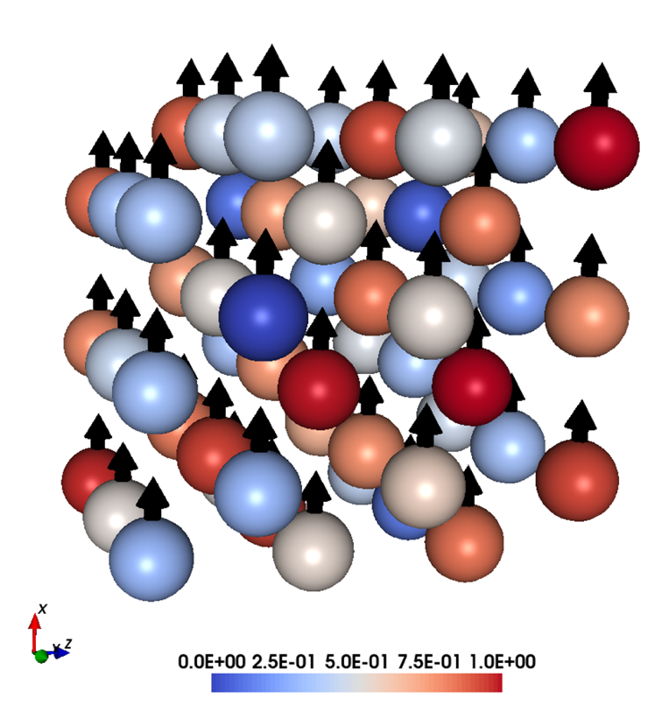
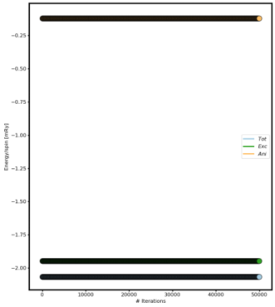

.. contents:: Table of Contents
Tutorial 1
==========
Fe in bcc and fcc crystal structures
------------------------------------
Collinear magnon spectra and influence of uniaxial anisotropy
^^^^

This example shows how to calculate the spin wave spectrum of the standard examples Fe bcc and Fe fcc and to understand the influence of the number of atoms per unit cell on the spectra together with the influence of the uniaxial anisotropy.

Crystal & magnetic structure
^^^^
Using the lines below with the indicated files, the crystal and magnetic structure are readily available, so that an Fe bcc system is created.

::

  simid bccFe100
  ncell     10        10       10                 System size
  BC        P         P         P                 Boundary conditions (0=vacuum, P=periodic)
  cell      1.00000   0.00000   0.00000
           0.00000   1.00000   0.00000
           0.00000   0.00000   1.00000
  Sym       0      Symmetry of lattice (0 for no, 1 for cubic, 2 for 2d cubic, 3 for hexagonal)
  posfile    ./posfile
  momfile    ./momfile
  exchange   ./jfile
  anisotropy ./kfile
  do_prnstruct 2          Flag to print lattice structure (0=off/1=on/2=print only coordinates)

Thermalizing the system
^^^^
Using the lines below, the systems is driven to the ground state.

::

  ip_mode   M
  ip_mcanneal 1
  10000 0.001 1.00e-16 0.95
  
  mode      M
  Temp      0.001          K                      Temperature of the system
  hfield    0.00000   0.00000   0.00000           Static H field
  mcNstep   50000                                 MC steps

