Magnon spectra and noncollinear magnetism
=========================================

Exercise 1: FM Heisenberg nearest-neighbour spin chain
------------------------------------------------------

Collinear adiabatic magnon spectra and S(q,w)
^^^^^^^^^^^^^^^^^^^^^^^^^^^^^^^^^^^^^^^^^^^^^

The following tutorial shows every step necessary to calculate adiabatic spin wave spectrum and dynamic structure factor S(q,w) through the simple example of the ferromagnetic spin chain. Notice that the classical magnetic ground state of the Hamiltonian defined in this example is where every spin have the same direction. The global orientation of the spins is arbitrary since the Hamiltonian is isotropic. Files are found in ``HeisChain`` folder. Some blocks of the `ìnpsd.dat``file are inlined in the following to highlight the key words that control calculation of adiabatic magnon spectra and calculation of the dynamic structure factor.

Crystal & magnetic structure
^^^^^^^^^^^^^^^^^^^^^^^^^^^^

Using the lines below with the indicated files, the crystal and magnetic structure are readily available, so that a 1D Heisenberg chain is created. The chain extends over 100 sites along the z direction. Have a look on the posfile and momfile. The nearest neighbor ferromagnetic exchange coupling is contained in the jfile.
::

  simid     HeisWire                              System name
  ncell     1         1         100               System size (in terms of unit cells)
  BC        0         0         P                 Boundary conditions (0=vacuum,P=periodic)
  cell      1.00000   0.00000   0.00000
            0.00000   1.00000   0.00000
            0.00000   0.00000   1.00000
  Sym       1                                     Symmetry of lattice (0 for no, 1 for cubic, 2 for 2d cubic, 3 for hexagonal)

  posfile   ./posfile                             Position file
  exchange  ./jfile                               Exchange file
  momfile   ./momfile                             Moment file
  do_prnstruct 1                                  Flag to print lattice structure (0=off/1=on/2=print only coordinates)

  Mensemble 1                                     Number of samples in ensemble averaging
  Initmag   3                                     (1=random, 2=cone, 3=spec., 4=file)

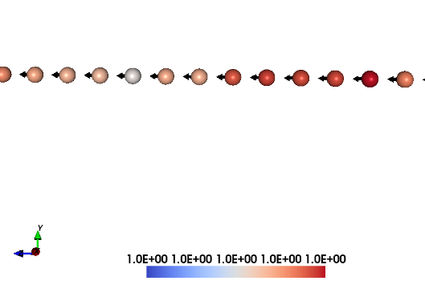

Fig 1. Crystal and magnetic texture.

**The first Brillouin zone of a simple cubic (sc) lattice**

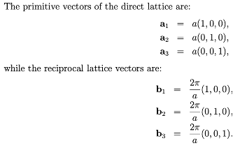

Fig 3. Primitive and reciprocal lattice vectors in sc.

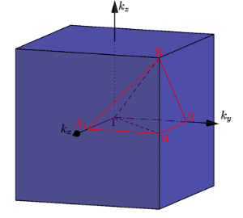

Fig 4. sc 1st Brillouin zone.

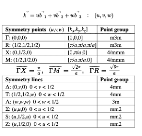

Fig 5. High symmetry points.

Calculation of spin wave spectrum
^^^^^^^^^^^^^^^^^^^^^^^^^^^^^^^^^

We calculate the spin wave spectrum (in this case, a collinear adiabatic magnon spectra) at the list of Q points contained in the ``qfile``. The spin wave spectra is calculated as excititions from the T=0 K ferromagnetic ground state.

::

  do_ams Y                         Collinear Adiabatic magnon spectra
  do_magdos N                      Generate magnon density of states

  qpoints F                        Flag for q-point generation (F=file,A=automatic,C=full cell)
  qfile   ./qfile                  Path along the high symmetry points in the reciprocal space

Spin dynamics and sampling of the dynamic structure factor
^^^^^^^^^^^^^^^^^^^^^^^^^^^^^^^^^^^^^^^^^^^^^^^^^^^^^^^^^^

Using the lines below, the systems is equilibrated in spin dynamics simulations to be in thermal equilibrium with a small temperature T=0.001 K.
::

  ip_mode   S                                     Initial phase parameters
  ip_nphase 1
  20000 1.0e-3 1e-16 4.0

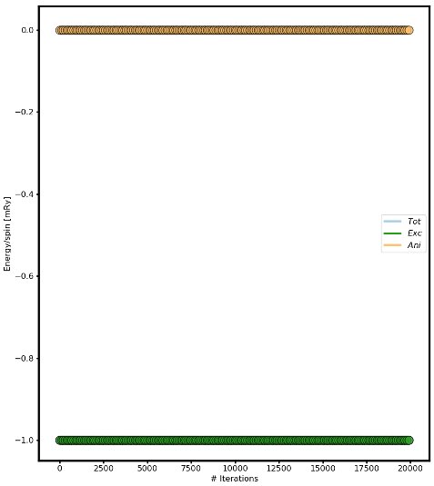

Fig 2. Energy versus number of iterations.

The dynamical structure factor is sampled in spin dynamics simulation at the same temperature T=0.001 K as used in the initial phase used to thermalize the system. The time step is 1 fs, and a small damping 0.0010 is used.
::

  mode      S                                     S=SD, M=MC
  temp      1.0e-3                                Measurement phase parameters
  damping   0.0010                                --
  Nstep     40000                                 --
  timestep  1.000e-15                             --

  do_sc Q                                         Measure spin correlation
  sc_window_fun  2                                Choice of FFT window function (1=box, 2=Hann, 3=Hamming, 4=Blackman-Harris)
  do_sc Q           Measure spin correlation
  sc_window_fun  2  Choice of FFT window function (1=box, 2=Hann, 3=Hamming, 4=Blackman-Harris)
  sc_nstep 5000     Number of steps to sample
  sc_step 8         Number of time steps between each sampling

Plotting adiabatic magnon spectrum spectra and the dynamic structure factor
^^^^^^^^^^^^^^^^^^^^^^^^^^^^^^^^^^^^^^^^^^^^^^^^^^^^^^^^^^^^^^^^^^^^^^^^^^^

Use the UppASD graphical interface (ASD_GUI) or the ``postQ.py`` script to plot the adiabatic magnon spectra and the dynamical structure factor.

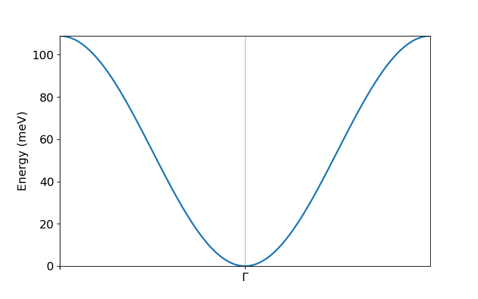

Fig 6. Adiabatic magnon spectra is output to the file ams.png.

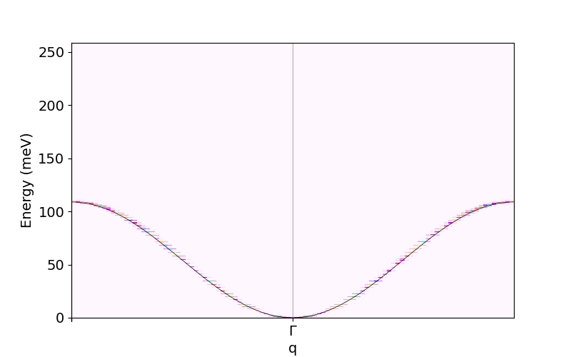

Fig 7. Adiabatic magnon spectra together with dynamic structure factor is output to ams_sqw.png.

Questions and exercises:
^^^^^^^^^^^^^^^^^^^^^^^^

1. Does it follows the analytical expression predicted by Linear Spin Wave Theory?

Exercise 2: AFM Heisenberg nearest-neighbour spin chain
-------------------------------------------------------

Collinear adiabatic magnon spectra and S(q,w)
^^^^^^^^^^^^^^^^^^^^^^^^^^^^^^^^^^^^^^^^^^^^^

The following tutorial shows every step necessary to calculate the spin wave spectrum and S(q,w) through the simple example of the antiferromagnetic spin chain. Notice that AMS in this case does not work for the primitive unit cell and it is necessary to set up a 1x1x2 magnetic supercell of from the crystal unit cell and define both spin directions in the supercell. The chain has 200 spins along the z direction. Files are found in HeisChainAF folder.

Crystal & magnetic structure
^^^^^^^^^^^^^^^^^^^^^^^^^^^^

Using the lines below with the indicated files, the crystal and magnetic structure are readily available, so that an 1D AFM Heisenberg chain is created. Have a look on the posfile and momfile. The nearest neighbor antiferromagnetic exchange coupling is contained in the jfile.

::

  simid     HeisWire
  ncell     1         1         100               System size
  BC        0         0         P                 Boundary conditions (0=vacuum,P=periodic)
  cell      1.00000   0.00000   0.00000
            0.00000   1.00000   0.00000
            0.00000   0.00000   2.000000
  Sym       1                                     Symmetry of lattice (0 for no, 1 for cubic, 2 for 2d cubic, 3 for hexagonal)

  posfile   ./posfile
  exchange  ./jfile
  momfile   ./momfile
  do_prnstruct 1                                 Print lattice structure (0=no, 1=yes)
  maptype   2                                    1=cartessian coordinates, 2=Direct coordinates

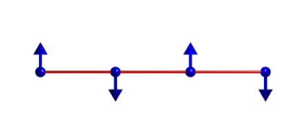

Fig 1. Crystal and magnetic texture.

Spin dynamics
^^^^^^^^^^^^^

Using the lines below, the systems is driven to the ground state by spin dynamics.

::

  ip_mode   S                                     Initial phase parameters
  ip_nphase 1
  20000 1.0e-3 1e-16 4.0

  mode      S                                     S=SD, M=MC
  temp      1.0e-3                                Measurement phase parameters
  damping   0.0010                                --
  Nstep     45000                                 --
  timestep  1.000e-15                             --

.. figure:: figures/tutorial3/fig2.png

Fig 2. Energy versus number of iterations.

Spin wave spectrum
^^^^^^^^^^^^^^^^^^

We calculate the spin wave spectrum (in this case, a collinear adiabatic magnon spectra) at the list of Q points (qfile). Use qmaker script.

::

  do_ams Y                      Collinear Adiabatic magnon spectra
  do_magdos N                   Generate magnon density of states

  qpoints D                     Flag q-point generation(F=file,A=automa.,C=full cell,D=external
                                file with direct coordinates)
  qfile   ./qfile               Path along the high symmetry points in the reciprocal space

**The first Brillouin zone of a simple cubic lattice**

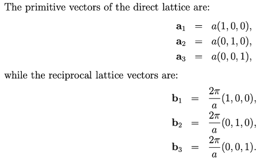

Fig 3. Primitive and reciprocal lattice vectors in sc.

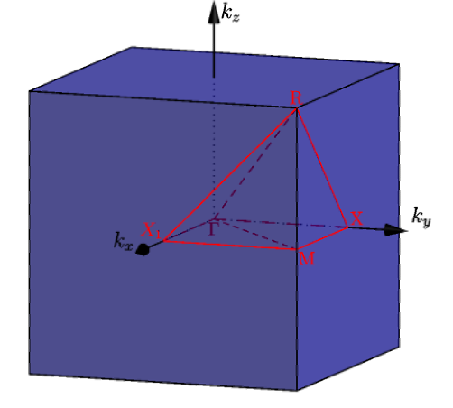

Fig 4. SC 1st Brillouin zone.

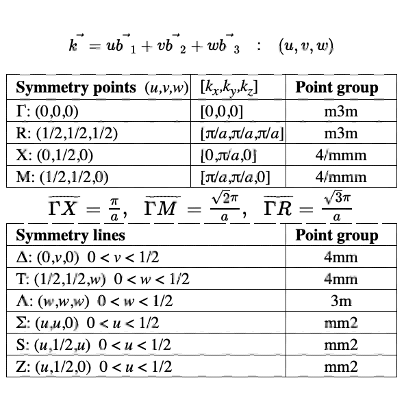

Fig 5. High symmetry points.

Plotting adiabatic magnon spectrum in the framework of Linear Spin Wave Theory
^^^^^^^^^^^^^^^^^^^^^^^^^^^^^^^^^^^^^^^^^^^^^^^^^^^^^^^^^^^^^^^^^^^^^^^^^^^^^^

Use the UppASD graphical interface (ASD_GUI) or the script enclosed in this course (plotsqw_course). Use option 2. File to print out “ams.HeisWire.out”.

1. Use only the primitive cell.

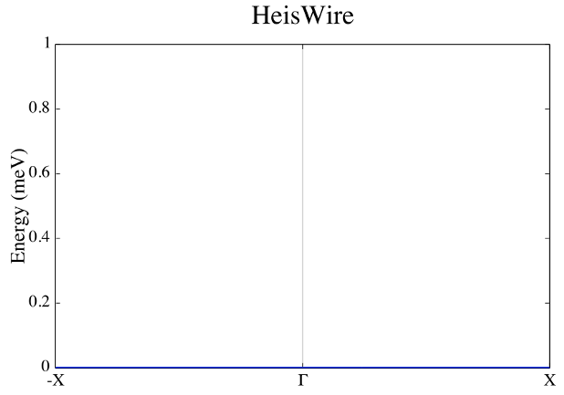

Fig 6. Adiabatic magnon spectra.

2. Use the magnetic supercell 1x1x2 of the crystal cell

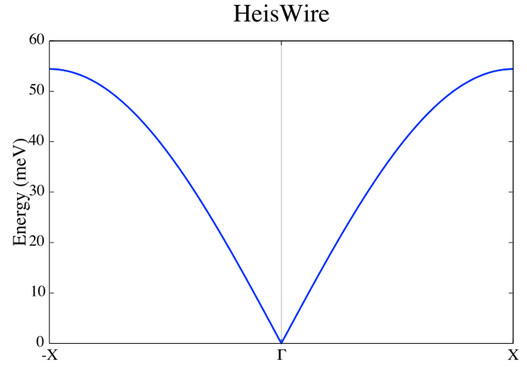

Fig 7. Adiabatic magnon spectra.

Plotting S(q,w)
^^^^^^^^^^^^^^^

Use the UppASD graphical interface (ASD_GUI) or the script enclosed in this course (plotsqw_course). Use option 1 for S(q,w) or option 3 for S(q,w) with AMS. File to print out “sqw.HeisWire.out”.

::

  do_sc Q           Measure spin correlation
  sc_window_fun  2  Choice of FFT window function (1=box, 2=Hann, 3=Hamming, 4=Blackman-Harris)
  sc_nstep 3000     Number of steps to sample
  sc_step  15       Number of time steps between each sampling

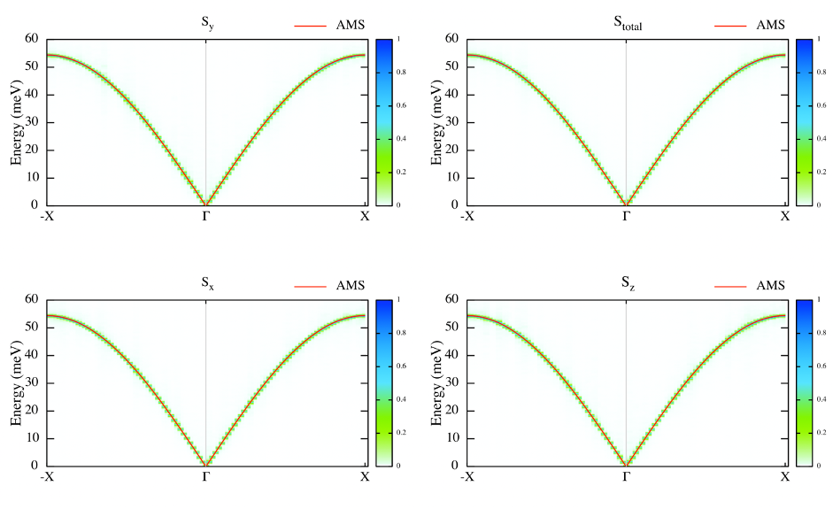

Fig 8. Structure factor with AMS.

Questions and exercises:
^^^^^^^^^^^^^^^^^^^^^^^^

1. Does it follows the analytical expression predicted by Linear Spin Wave Theory? Why is linear around the center zone?
2. Calculate analytically the Energy/spin and show it is the same as the numerical result.

Exercise 3: bcc Fe at different temperature
------------------------------------------------

Collinear magnon spectra and influence of uniaxial anisotropy
^^^^^^^^^^^^^^^^^^^^^^^^^^^^^^^^^^^^^^^^^^^^^^^^^^^^^^^^^^^^^

This example shows how to calculate the spin wave spectrum of the standard example bcc Fe and to understand the influence of the temperature on the spectra together with the influence of the uniaxial anisotropy. Files are found in the ``bccFeT1K`` and ``bccFeT300K`` folders.

Crystal & magnetic structure
^^^^^^^^^^^^^^^^^^^^^^^^^^^^

Using the lines below with the indicated files, the crystal and magnetic structure are readily available, so that a simulation of an Fe bcc system is set up.

::

  simid bccFe100
  ncell     20       20      20                   System size
  BC        P         P         P                 Boundary conditions (0=vacuum, P=periodic)
  cell         -0.5000000000    0.5000000000    0.5000000000
                0.5000000000   -0.5000000000    0.5000000000
                0.5000000000    0.5000000000   -0.5000000000
  Sym       1                                     Symmetry of lattice (0 for no, 1 for cubic, 2 for 2d cubic, 3 for hexagonal)

  posfile   ./posfile
  momfile   ./momfile
  exchange  ./jASD2S
  anisotropy ./kfile
  maptype 2

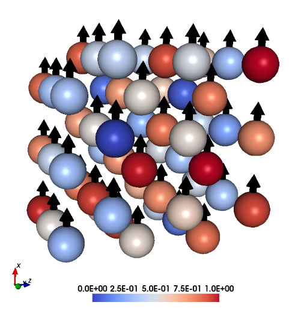

Fig 1. Lattice and magnetic texture.

Thermalizing the system
^^^^^^^^^^^^^^^^^^^^^^^

Using the lines below, the system is brought to thermal equilibrium by means of Heat bath Monte Carlo.

::

  ip_mode   H                                     Initial phase parameters
  ip_mcanneal 1                                   --
  10000 1.0 1.00e-16 0.3                          --

Linear spin wave spectra
^^^^^^^^^^^^^^^^^^^^^^^^

Below the critical temperature bcc Fe has long range collinear ordering of spins. We calculate the adiabatic magnon spectra (AMS) using linear spin wave theory for collinear spin textures at the list of q points specified in the ``qfile.kpath``. Note that the spin wave is calculated for the T=0 K ground state as specified in the ``momfile``.  The list of q points were calculated from the ``preQ.py`` script which analyses the space group symmetry of the crystal cell,

::

  do_ams Y                                        Collinear Adiabatic magnon spectra
  do_magdos Y                                     Calculate magnon density of states
  qpoints D                                       Direct coordinates
  qfile ./qfile.kpath                             q points

**The first Brillouin zone of a body centered cubic lattice**

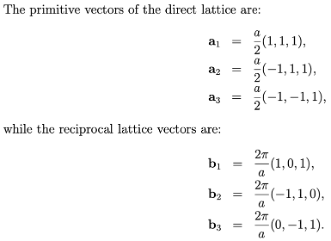

Fig 3. Primitive and reciprocal lattice vectors in bcc.

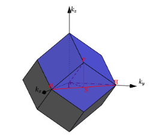

Fig 4. BCC 1st Brillouin zone.

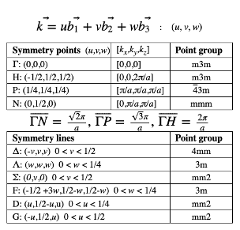

Fig 5. High symmetry points.

Plotting the spectrum
^^^^^^^^^^^^^^^^^^^^^

Use the UppASD graphical interface ``ASD_GUI`` or the ``postQ.py`` script to plot the linear spin wave spectra and the dynamical structure factor.

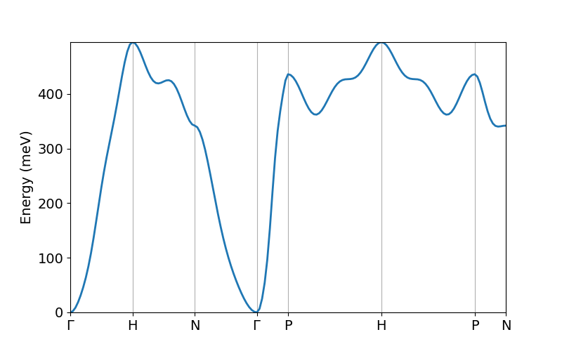

Fig 6. Adiabatic magnon spectra.

Questions and exercises:
^^^^^^^^^^^^^^^^^^^^^^^^

1. Does the spectra follow the analytical expression?
2. Why the spectra is shift it up?
3. Plot the spectra without the gap around the center zone.
4. Why there are two branches, 1 acoustic and 1 optical?
5. Plot the spectrum for Fe fcc. Why now there is just 1 branch? Is it following the analytical expression?

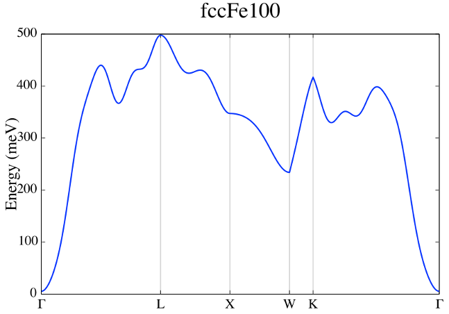

Fig 7. Adiabatic magnon spectra of Fe FCC.

Exercise 4: Kagome system with DM interactions
----------------------------------------------

Non-Collinear adiabatic magnon spectra and S(q,w)
^^^^^^^^^^^^^^^^^^^^^^^^^^^^^^^^^^^^^^^^^^^^^^^^^

The following tutorial serves as introduction to non-collinear AMS when the unit cell is commensurate with the magnetic unit lattice. It shows every step necessary to calculate non-collinear spin wave spectrum and S(q,w). Files are found in Kagome_ncAMS folder.

Crystal & magnetic structure
^^^^^^^^^^^^^^^^^^^^^^^^^^^^

Using the lines below with the indicated files, the crystal and magnetic structure are readily available, so that an Kagome system with DM interaction is created. Have a look to posfile and momfile, etc.

::

  simid  kagome_T
  ncell    66 66 1
  BC         P P 0
  cell     1.000000000000    0.000000000000    0.000000000000
          -0.500000000000    0.866025403784    0.000000000000
           0.000000000000    0.000000000000    10.00000000000

  Sym        0

  posfile    ./posfile
  posfiletype D               C=Cartesian or D=direct coordinates in posfile
  momfile    ./momfile
  exchange   ./jfile

  maptype 2
  do_jtensor 1

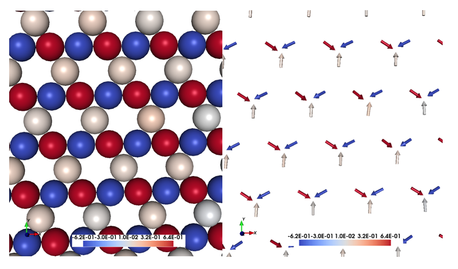

Fig 1. Crystal and magnetic texture.

Spin dynamics
^^^^^^^^^^^^^

Using the lines below, and using a momfile with previous minimization, the system is already in the ground-state. This is just to speed up the simulation time.

::

  ip_mode N
  ip_mcanneal 2
  10000 100.0001
  10000 0.0001

  mode      S                                     S=SD, M=MC
  temp      0.0001
  Nstep     60000
  damping   0.001
  timestep  1d-16

Spin wave spectrum
^^^^^^^^^^^^^^^^^^

We calculate the non-collinear spin wave spectrum (in this case, a collinear adiabatic magnon spectra) at the list of Q points (qfile). Use qmaker script.

::

  do_ams Y                      Collinear Adiabatic magnon spectra
  do_diamag Y                   Non-Collinear Adiabatic magnon spectra

  qpoints D                     Flag q-point generation(F=file,A=automa.,C=full cell,D=external
                                file with direct coordinates)
  qfile   ./qfile               Path along the high symmetry points in the reciprocal space

**The first Brillouin zone of a hexagonal lattice**

.. figure:: figures/tutorial5/fig2.png

Fig 2. Primitive and reciprocal lattice vectors in hcp with 1st Brillouin zone and High symmetry points.

Plotting adiabatic magnon spectrum in the framework of Linear Spin Wave Theory
^^^^^^^^^^^^^^^^^^^^^^^^^^^^^^^^^^^^^^^^^^^^^^^^^^^^^^^^^^^^^^^^^^^^^^^^^^^^^^

Use the UppASD graphical interface (ASD_GUI) or the script enclosed in this course (plotsqw_course). Use option 4. File to print out “ncams.kagome_T.out”.

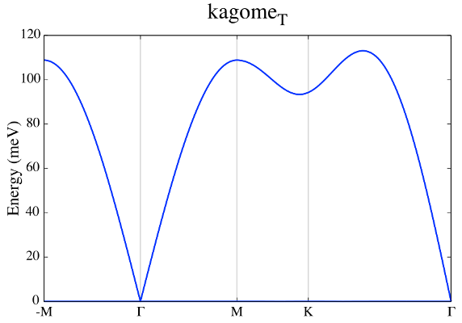

Fig 3. Non-Collinear AMS.

Plotting S(q,w)
^^^^^^^^^^^^^^^

Use the UppASD graphical interface (ASD_GUI) or the script enclosed in this course (plotsqw_course). Use option 1 for S(q,w), option 4 for S(q,w) with NC_AMS. File to print out “ncams.kagome_T.out” and “sqw.kagome_T.out”.

::

  do_sc  Q
  sc_nstep 500
  sc_step   90
  do_sc_local_axis B             Perform SQW along local quantization axis (SA) (Y/N/B)
                                 B--> B_effxSA
  sc_window_fun 2                Choice of FFT window function (1=box, 2=Hann, 3=Hamming,
                                 4=Blackman-Harris)
  sc_average N                   Averaging of S(q,w): (F)ull, (E)ven, or (N)one
  do_sc_tens N                   Print the tensorial values s(q,w) (Y/N)

  qpoints D
  qfile ./qfile

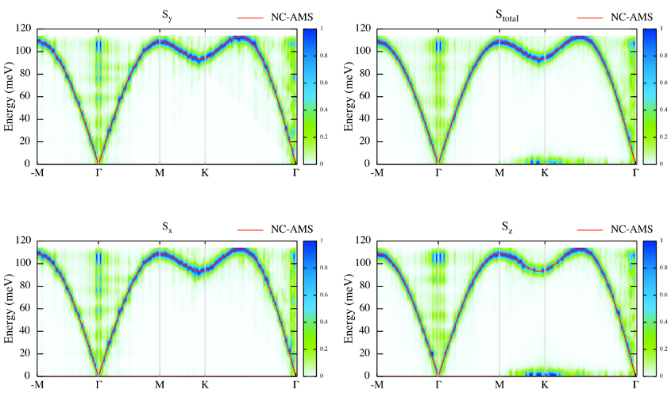

Fig 4. Structure factor together with non-Collinear AMS.

Questions and exercises:
^^^^^^^^^^^^^^^^^^^^^^^^

1. Is there only one branch?
2. Seems linear around Gamma point but J is FM? Why is that? Shouldn´t be parabolic?

Exercise 5: Triangular system with AFM interactions
---------------------------------------------------

Non-Collinear adiabatic magnon spectra and S(q,w)
^^^^^^^^^^^^^^^^^^^^^^^^^^^^^^^^^^^^^^^^^^^^^^^^^

The following tutorial serves as how to use non-collinear AMS for systems that are not commensurate with the magnetic unit cell. It shows every step necessary to calculate non-collinear spin wave spectrum and S(q,w). Files are found in Triangular_ncAMS folder.

Crystal & magnetic structure
^^^^^^^^^^^^^^^^^^^^^^^^^^^^

Using the lines below with the indicated files, the crystal and magnetic structure are readily available, so that an AFM triangular lattice is created. Have a look to posfile and momfile, etc.

::

  simid  triang_T
  ncell    66 66 1
  BC         P P 0
  cell     1.000000000000    0.000000000000    0.000000000000
          -0.500000000000    0.866025403784    0.000000000000
           0.000000000000    0.000000000000    10.00000000000

  Sym        3                Symmetry of lattice (0 for no, 1 for cubic, 2 for 2d cubic, 3 for hexagonal)

  posfile    ./posfile
  posfiletype D                C=Cartesian or D=direct coordinates
  momfile    ./momfile
  exchange   ./jfile

  maptype 2
  do_jtensor 1

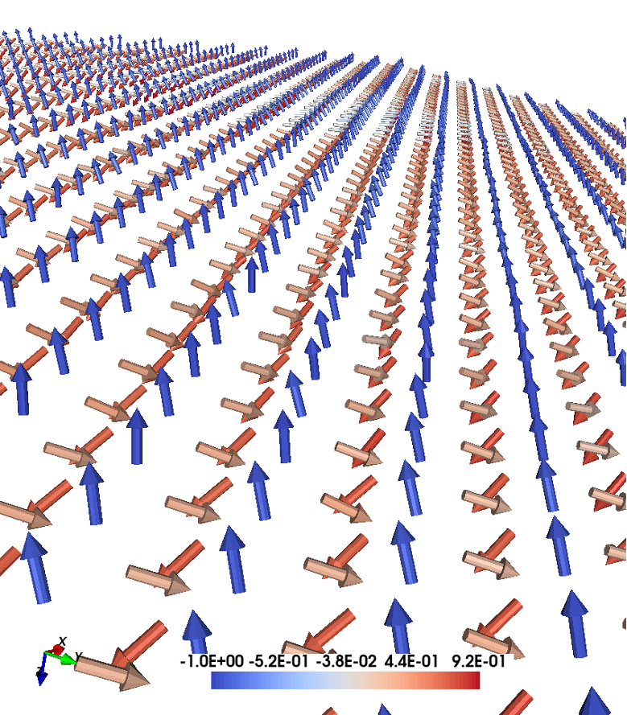

Fig 1. Crystal and magnetic texture.

Spin dynamics
^^^^^^^^^^^^^

Using the lines below the system is evolved in time. Notice that in the initial phase, we use a minimization of the spin-spiral energy, and by doing that, the ordering wave vector is calculated. In a second calculation, the adiabatic magnon spectra is calculated by using the already calculated ordering wave vector of the spin spiral based on the direction provided by the spin vector qm_svec and qm_nvec which is perpendicular to the given spin direction.

::

  ip_mode Q                                Activate qminimizer
                                           minimize spin-spiral energy
                                           calculate ordering wave vector, etc.
  ip_nphase 1
  50000 0.00000 1.0e-16 5.0
  10000 300.0001 1.0e-16 5.0
  10000 100.0001 1.0e-16 5.0
  10000 10.0001  1.0e-16 5.0
  20000 1.0001   1.0e-16 5.0
  50000 0.00000 1.0e-16 5.0

  mode      S                                     S=SD, M=MC
  temp      0.1
  Nstep     59500
  damping   0.001
  timestep  1e-16
  qm_nvec 0 0 1                             Unit-vector perpendicular to spins
  qm_svec 0 1 0                             Direction of the spin

Spin wave spectrum
^^^^^^^^^^^^^^^^^^

We calculate the non-collinear spin wave spectrum (in this case, a collinear adiabatic magnon spectra) at the list of Q points (qfile). Use qmaker script.

::

  do_diamag Y                   Non-Collinear Adiabatic magnon spectra

  qpoints D                     Flag q-point generation(F=file,A=automa.,C=full cell,D=external
                                file with direct coordinates)
  qfile   ./qfile               Path along the high symmetry points in the reciprocal space

  nc_qvect 0.330000 0.571577 0.000000   Ordering wave vector
  nc_nvect 0.0 0.0 1.0                  Pitch-vector along z and the moments rotate
                                        in the xy-plane
  qm_nvec 0 0 1                             Unit-vector perpendicular to spins
  qm_svec 0 1 0                             Direction of the spin

**The first Brillouin zone of a hexagonal lattice**

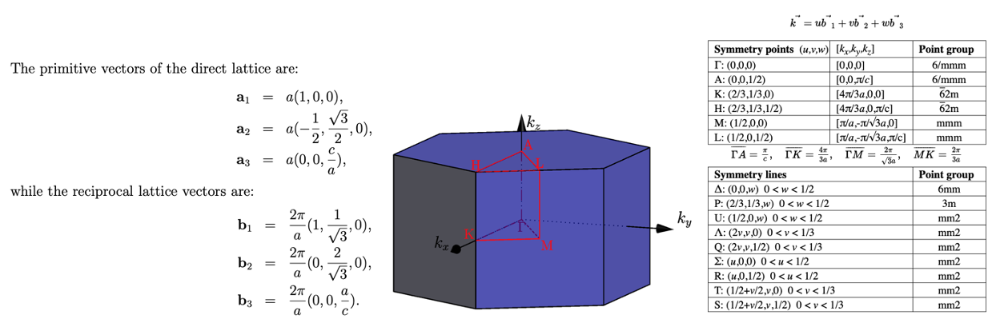

Fig 2. Primitive and reciprocal lattice vectors in hcp with 1st Brillouin zone and High symmetry points.

Plotting adiabatic magnon spectrum in the framework of Linear Spin Wave Theory
^^^^^^^^^^^^^^^^^^^^^^^^^^^^^^^^^^^^^^^^^^^^^^^^^^^^^^^^^^^^^^^^^^^^^^^^^^^^^^

Use the UppASD graphical interface (ASD_GUI) or the script enclosed in this course (plotsqw_course). Use option 7. File to print out “ncams.kagome_T.out”, “ncams+q.triang_T.out” and “ncams-q.triang_T.out”

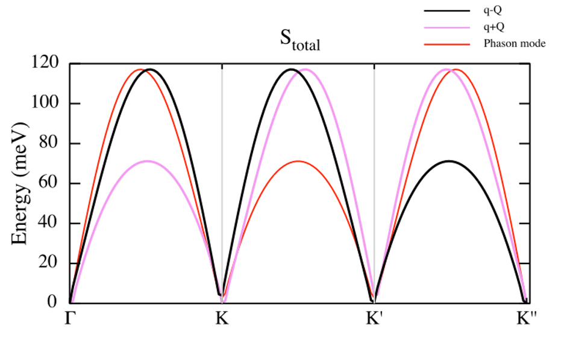

Fig 3. Non-Collinear AMS.

Plotting S(q,w)
^^^^^^^^^^^^^^^

Use the UppASD graphical interface (ASD_GUI) or the script enclosed in this course (plotsqw_course). Use option 1 for S(q,w), option 6 for S(q,w) with NC_AMS+Q. File to print out “ncams.kagome_T.out”, “sqw.kagome_T.out”,” ncams+q.triang_T.out” and “ncams-q.triang_T.out”.

::

  do_sc  Q
  sc_nstep 700
  sc_step   85
  do_sc_local_axis B             Perform SQW along local quantization axis (SA) (Y/N/B)
                                 B--> B_effxSA
  sc_window_fun 2                Choice of FFT window function (1=box, 2=Hann, 3=Hamming,
                                 4=Blackman-Harris)

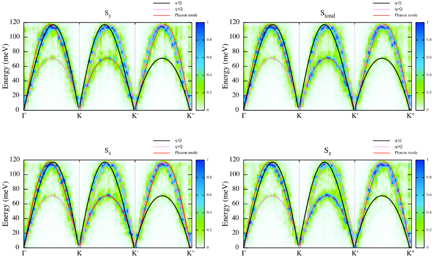

Fig 4. Structure factor together with non-Collinear AMS with non-zero ordering wave vector.

Questions and exercises:
^^^^^^^^^^^^^^^^^^^^^^^^

1. Why we have 3 branches, with just 1 atom per unit cell?
2. Is it the profile of an antiferromagnet around the Gamma point?

**Some preliminary and useful equations:**

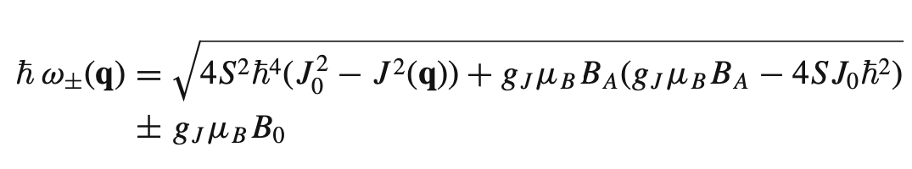

Eq 1. Excitation energy for spin waves in an anisotropic antiferromagnet.

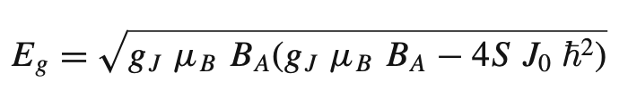

Eq 2. Energy gap due to the anisotropy.

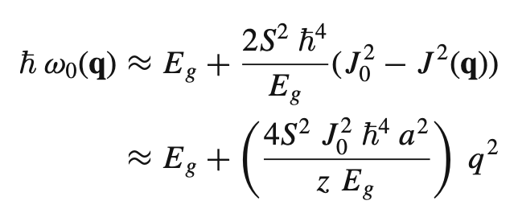

Eq 3. Excitation energy for spin waves in an anisotropic ferromagnet.

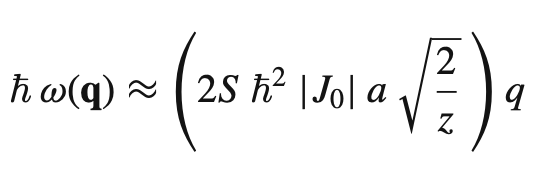

Eq 4. Excitation energy for spin waves in an isotropic antiferromagnet.

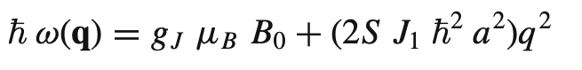

Eq 5. Excitation energy for spin waves in an isotropic ferromagnet.

Exercise 6: Spin wave stiffness
-------------------------------

The spin wave stiffness and the related property exchange stiffness provides the bridge between atomistic spin dynamics and micromagnetism.

A setup for bcc Fe where the stiffness can be calculated can be seen below

.. literalinclude:: Stiffness/inpsd.dat

Notice that we actually have no ``ip_mode`` nor ``mode`` sections, because here we are actually not interested in running any simulation.

The ``posfile`` and ``momfile`` are here as follows

.. literalinclude:: Stiffness/posfile

.. literalinclude:: Stiffness/momfile

The exchange interaction file ``jASD2S`` can be downloaded from :download:`here <https://raw.githubusercontent.com/UppASD/UppASD/master/examples/Mappings/bccFe-variants/jASD2S>` .

 * Calculate the spin wave stiffness for the system and examine how the results depend on the choice of ``eta_max`` and ``eta_min``.

The output from the stiffness calculations are found in the ``asd_micro.bccFe100.out`` file.

Tutorial 0b: Spin wave scripts
------------------------------

Even though the calculation of magnon spectra will be practiced on in more detail enough,
one can also use the setup above to quickly showcase the functionality of the ``preQ.py`` and ``postQ.py`` scripts.

These scripts are available in the repository but are continiously evolving. Up-to-date scripts are provided here: :download:`preQ.py <https://raw.githubusercontent.com/UppASD/UppASD/refs/heads/master/ASD_Tools/preQ.py>` and :download:`postQ.py <https://raw.githubusercontent.com/UppASD/UppASD/refs/heads/master/ASD_Tools/postQ.py>`

 * Use the ``preQ.py`` script to setup a k-space path for the spin wave dispersion in bcc Fe, run the system, and plot the resulting ``ams.png`` by using ``postQ.py``.

Optional:
 * The ``preQ.py`` script provides several k-space paths. Compare the calculated magnon DOS ``magdos.bccFe100.out`` when using either ``qpoints D`` and ``qfile ./qfile.kpath`` or ``qpoints R`` and ``qfile ./qfile.reduced``.
