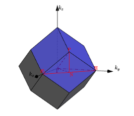
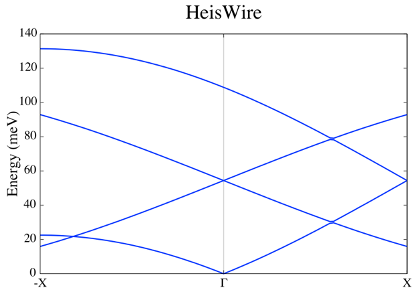
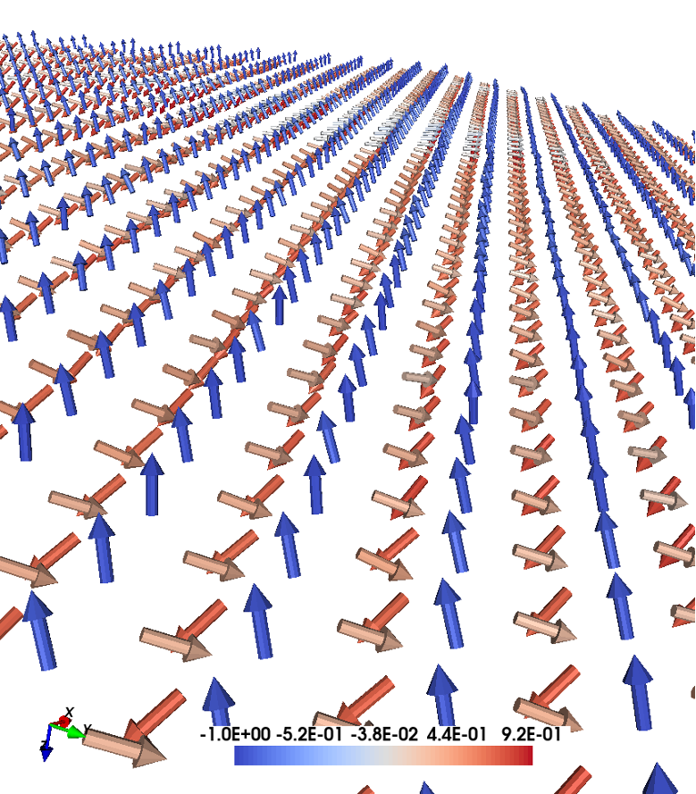

Magnon spectra and noncollinear magnetism
=========================================

Tutorial 1: Fe in bcc and fcc crystal structures
------------------------------------------------

Collinear magnon spectra and influence of uniaxial anisotropy
^^^^^^^^^^^^^^^^^^^^^^^^^^^^^^^^^^^^^^^^^^^^^^^^^^^^^^^^^^^^^

This example shows how to calculate the spin wave spectrum of the standard examples Fe bcc and Fe fcc and to understand the influence of the number of atoms per unit cell on the spectra together with the influence of the uniaxial anisotropy.

Crystal & magnetic structure
^^^^^^^^^^^^^^^^^^^^^^^^^^^^

Using the lines below with the indicated files, the crystal and magnetic structure are readily available, so that an Fe bcc system is created.

::

  simid bccFe100
  ncell     10        10       10                 System size
  BC        P         P         P                 Boundary conditions (0=vacuum, P=periodic)
  cell      1.00000   0.00000   0.00000
            0.00000   1.00000   0.00000
            0.00000   0.00000   1.00000
  Sym       0      Symmetry of lattice (0 for no, 1 for cubic, 2 for 2d cubic, 3 for hexagonal)
  posfile    ./posfile
  momfile    ./momfile
  exchange   ./jfile
  anisotropy ./kfile
  do_prnstruct 2          Flag to print lattice structure (0=off/1=on/2=print only coordinates)

.. figure:: figures/tutorial1/fig1.png

Fig 1. Lattice and magnetic texture.

Thermalizing the system
^^^^^^^^^^^^^^^^^^^^^^^

Using the lines below, the systems is driven to the ground state.

::

  ip_mode   M
  ip_mcanneal 1
  10000 0.001 1.00e-16 0.95
  
  mode      M
  Temp      0.001          K                      Temperature of the system
  hfield    0.00000   0.00000   0.00000           Static H field
  mcNstep   50000                                 MC steps

.. figure:: figures/tutorial1/fig2.png

Fig 2. Energy versus number of iterations.

Spin wave spectrum
^^^^^^^^^^^^^^^^^^
We calculate the spin wave spectrum (in this case, a collinear adiabatic magnon spectra (AMS)) at the list of Q points ``qfile``. Use ``qmaker`` script.

::

  do_ams Y                         Collinear Adiabatic magnon spectra
  qpoints D                        Direct coordinates
  qfile ./qfile                    Path along the high symmetry points in the reciprocal space

**The first Brilluoin zone of a body centered cubic lattice**

.. figure:: figures/tutorial1/fig3.png

Fig 3. Primitive and reciprocal lattice vectors in bcc.

Fig 4. BCC 1st Brilluoin zone.

.. figure:: figures/tutorial1/fig5.png

Fig 5. High symmetry points.

Plotting the spectrum
^^^^^^^^^^^^^^^^^^^^^

Use the UppASD graphical interface (ASDGUI) or the script enclosed in this course (plotsqw_course). Use option 2.

Fig 6. Adiabatic magnon spectra.

Questions and exercises:
^^^^^^^^^^^^^^^^^^^^^^^^

1. Does the spectra follow the analytical expression?
2. Why the spectra is shift it up? 
3. Plot the spectra without the gap around the center zone.
4. Why there are two branches, 1 acoustic and 1 optical?
5. Plot the spectrum for Fe fcc. Why now there is just 1 branch? Is it following the analytical expression?

.. figure:: figures/tutorial1/fig7.png

Fig 7. Adiabatic magnon spectra of Fe FCC.

Tutorial 2
==========
 
FM Heisenberg nearest-neighbour spin chain
------------------------------------------

Collinear adiabatic magnon spectra and S(q,w)
^^^^
The following tutorial shows every step necessary to calculate spin wave spectrum and S(q,w) through the simple example of the ferromagnetic spin chain. Notice that the classical magnetic ground state of the Hamiltonian defined in this example is where every spin have the same direction, the direction is arbitrary since the Hamiltonian is isotropic.

Crystal & magnetic structure
^^^^

Using the lines below with the indicated files, the crystal and magnetic structure are readily available, so that an 1D Heisenberg chain is created.
::

  simid     HeisWire                              System name
  ncell     1         1         100               System size (in terms of unit cells)
  BC        0         0         P                 Boundary conditions (0=vacuum,P=periodic)
  cell      1.00000   0.00000   0.00000
           0.00000   1.00000   0.00000
           0.00000   0.00000   1.00000
  Sym       1                                     Symmetry of lattice (0 for no, 1 for cubic, 2 for 2d cubic, 3 for hexagonal)  
  
  posfile   ./posfile                             Position file
  exchange  ./jfile                               Exchange file
  momfile   ./momfile                             Moment file
  do_prnstruct 1          Flag to print lattice structure (0=off/1=on/2=print only coordinates)

.. figure:: figures/tutorial2/fig1.png

Fig 1. Crystal and magnetic texture.

Spin dynamics
^^^^

Using the lines below, the systems is driven to the ground state by spin dynamics.
::

  Mensemble 1                                     Number of samples in ensemble averaging
  Initmag   3                                     (1=random, 2=cone, 3=spec., 4=file)
  
  ip_mode   S                                     Initial phase parameters
  ip_nphase 1
  20000 1.0e-3 1e-16 4.0
  
  mode      S                                     S=SD, M=MC
  temp      1.0e-3                                Measurement phase parameters
  damping   0.0010                                --
  Nstep     40000                                 --
  timestep  1.000e-15                             --

.. figure:: figures/tutorial2/fig2.png

Fig 2. Energy versus number of iterations.

Spin wave spectrum
^^^^

We calculate the spin wave spectrum (in this case, a collinear adiabatic magnon spectra) at the list of Q points (qfile). Use qmaker script.

::

  do_ams Y                         Collinear Adiabatic magnon spectra
  do_magdos N                      Generate magnon density of states
  
  qpoints F                        Flag for q-point generation (F=file,A=automatic,C=full cell)
  qfile   ./qfile                  Path along the high symmetry points in the reciprocal space

**The first Brilluoin zone of a simple cubic lattice**

.. figure:: figures/tutorial2/fig3.png

Fig 3. Primitive and reciprocal lattice vectors in sc.

.. figure:: figures/tutorial2/fig4.png

Fig 4. SC 1st Brilluoin zone.

.. figure:: figures/tutorial2/fig5.png

Fig 5. High symmetry points.

Plotting adiabatic magnon spectrum in the framework of Linear Spin Wave Theory
^^^^
Use the UppASD graphical interface (ASDGUI) or the script enclosed in this course (plotsqw_course). Use option 2. File to print out “ams.HeisWire.out”.

.. figure:: figures/tutorial2/fig6.png

Fig 6. Adiabatic magnon spectra.

Plotting S(q,w)
^^^^
Use the UppASD graphical interface (ASDGUI) or the script enclosed in this course (plotsqw_course). Use option 1 for S(q,w) or option 3 for S(q,w) with AMS. File to print out “sqw.HeisWire.out”.

::

  do_sc Q           Measure spin correlation
  sc_window_fun  2  Choice of FFT window function (1=box, 2=Hann, 3=Hamming, 4=Blackman-Harris)
  sc_nstep 5000     Number of steps to sample
  sc_step 8        Number of time steps between each sampling

.. figure:: figures/tutorial2/fig7.png

Fig 7. Structure factor together with AMS.

Questions and exercises:
^^^^

1. Does it follows the analytical expression predicted by Linear Spin Wave Theory?

Tutorial 3
==========
 
AFM Heisenberg nearest-neighbour spin chain
-------------------------------------------

Collinear adiabatic magnon spectra and S(q,w)
^^^^

The following tutorial shows every step necessary to calculate spin wave spectrum and S(q,w) through the simple example of the antiferromagnetic spin chain. Notice that AMS in this case does not work for the primitive unit cell and it is necessary to a magnetic supercell 2x1x1 of the crystal cell and define both spin direction in the supercell.

Crystal & magnetic structure
^^^^

Using the lines below with the indicated files, the crystal and magnetic structure are readily available, so that an 1D AFM Heisenberg chain is created. Have a look to posfile and momfile.

::

  simid     HeisWire
  ncell     1         1         100               System size
  BC        0         0         P                 Boundary conditions (0=vacuum,P=periodic)
  cell      1.00000   0.00000   0.00000
             0.00000   1.00000   0.00000
            0.00000   0.00000   2.000000
  Sym       1                                     Symmetry of lattice (0 for no, 1 for cubic, 2 for 2d cubic, 3 for hexagonal)
  
  posfile   ./posfile
  exchange  ./jfile
  momfile   ./momfile
  do_prnstruct 1                                 Print lattice structure (0=no, 1=yes)
  maptype   2                                    1=cartessian coordinates, 2=Direct coordinates

.. figure:: figures/tutorial3/fig1.png

Fig 1. Crystal and magnetic texture.

Spin dynamics
^^^^

Using the lines below, the systems is driven to the ground state by spin dynamics.

::

  ip_mode   S                                     Initial phase parameters
  ip_nphase 1
  20000 1.0e-3 1e-16 4.0
  
  mode      S                                     S=SD, M=MC
  temp      1.0e-3                                Measurement phase parameters
  damping   0.0010                                --
  Nstep     45000                                 --
  timestep  1.000e-15                             --

.. figure:: figures/tutorial3/fig2.png

Fig 2. Energy versus number of iterations.

Spin wave spectrum
^^^^

We calculate the spin wave spectrum (in this case, a collinear adiabatic magnon spectra) at the list of Q points (qfile). Use qmaker script.

::

  do_ams Y                      Collinear Adiabatic magnon spectra
  do_magdos N                   Generate magnon density of states
  
  qpoints D                     Flag q-point generation(F=file,A=automa.,C=full cell,D=external
                                file with direct coordinates)
  qfile   ./qfile               Path along the high symmetry points in the reciprocal space

**The first Brilluoin zone of a simple cubic lattice**

.. figure:: figures/tutorial3/fig3.png

Fig 3. Primitive and reciprocal lattice vectors in bcc.

.. figure:: figures/tutorial3/fig4.png

Fig 4. BCC 1st Brilluoin zone.

Fig 5. High symmetry points.

Plotting adiabatic magnon spectrum in the framework of Linear Spin Wave Theory
^^^^

Use the UppASD graphical interface (ASDGUI) or the script enclosed in this course (plotsqw_course). Use option 2. File to print out “ams.HeisWire.out”.

1. Use only the primitive cell.

.. figure:: figures/tutorial3/fig6.png

Fig 6. Adiabatic magnon spectra.

2. Use the magnetic supercell 2x1x1 of the crystal cell

.. figure:: figures/tutorial3/fig7.png

Fig 7. Adiabatic magnon spectra.

Plotting S(q,w)
^^^^

Use the UppASD graphical interface (ASDGUI) or the script enclosed in this course (plotsqw_course). Use option 1 for S(q,w) or option 3 for S(q,w) with AMS. File to print out “sqw.HeisWire.out”.

:

  do_sc Q           Measure spin correlation
  sc_window_fun  2  Choice of FFT window function (1=box, 2=Hann, 3=Hamming, 4=Blackman-Harris)
  sc_nstep 3000     Number of steps to sample
  sc_step  15       Number of time steps between each sampling

Fig 8. Structure factor with AMS.

Questions and exercises:
^^^^

1. Does it follows the analytical expression predicted by Linear Spin Wave Theory? Why is linear around the center zone?
2. Calculate analytically the Energy/spin and show it is the same as the numerical result.

Tutorial 4
==========
 
FM Heisenberg nearest-neighbour spin chain with DM interactions
---------------------------------------------------------------

Non-Collinear adiabatic magnon spectra and S(q,w)
^^^^

The following tutorial serves as introduction to non-collinear AMS and shows every step necessary to calculate non-collinear spin wave spectrum and S(q,w) through the simple example of the ferromagnetic spin chain with DM interaction. Notice that AMS in this case does not work because the magnetic ground-state texture is non-collinear.

Crystal & magnetic structure
^^^^

Using the lines below with the indicated files, the crystal and magnetic structure are readily available, so that an 1D helical Heisenberg spin spiral is created. Have a look to posfile and momfile.

::

  simid     HeisWire
  ncell     1         1         100               System size
  BC        0         0         P                 Boundary conditions (0=vacuum,P=periodic)
  cell      1.00000   0.00000   0.00000
            0.00000   1.00000   0.00000
            0.00000   0.00000   4.00000
  Sym       0                                     Symmetry of lattice (0 for no, 1 for cubic, 2 for 2d cubic, 3 for hexagonal)
  
  posfile   ./posfile
  exchange  ./jfile
  momfile   ./momfile
  dm        ./dmfile
  do_prnstruct 1                                  Print lattice structure (0=no, 1=yes)
  maptype 2
  Mensemble 1                                     Number of samples in ensemble averaging
  Initmag   3                                     (1=random, 2=cone, 3=spec., 4=file)

.. figure:: figures/tutorial4/fig1.png

Fig 1. Crystal and magnetic texture.

Spin dynamics
^^^^

Using the lines below, the systems is driven to the ground state by MonteCarlo.

:

  ip_mode   M
  ip_mcanneal 1
  100000 1.0e-3
  
  mode      S                                     S=SD, M=MC
  temp      1.0e-3                                Measurement phase parameters
  damping   0.0010                                --
  Nstep     128000                                 --
  timestep  1.000e-15                             --

.. figure:: figures/tutorial4/fig2.png

Fig 2. Energy versus number of iterations.

Spin wave spectrum
^^^^

We calculate the non-collinear  and collinear spin wave spectrum at the list of Q points (qfile) for comparison. Use qmaker script.

:

  do_ams Y                      Collinear Adiabatic magnon spectra
  do_diamag Y                   Non-Collinear Adiabatic magnon spectra
  
  qpoints D                     Flag q-point generation(F=file,A=automa.,C=full cell,D=external
                                file with direct coordinates)
  qfile   ./qfile               Path along the high symmetry points in the reciprocal space

**The first Brilluoin zone of a simple cubic lattice**

.. figure:: figures/tutorial4/fig3.png

Fig 3. Primitive and reciprocal lattice vectors in bcc.

.. figure:: figures/tutorial4/fig4.png

Fig 4. BCC 1st Brilluoin zone.

.. figure:: figures/tutorial4/fig5.png

Fig 5. High symmetry points.

Plotting adiabatic magnon spectrum in the framework of Linear Spin Wave Theory
^^^^

Use the UppASD graphical interface (ASDGUI) or the script enclosed in this course (plotsqw_course). Use option 2. File to print out “ams.HeisWire.out”.

1. Collinear AMS

Fig 6. Collinear Adiabatic magnon spectra.

2. Non-Collinear AMS

Fig 7. Non-collinear Adiabatic magnon spectra.

Plotting S(q,w)
^^^^

Use the UppASD graphical interface (ASDGUI) or the script enclosed in this course (plotsqw_course). Use option 1 for S(q,w), option 4 for S(q,w) with NC_AMS and option 5 S(q,w) with AMS. File to print out “sqw.HeisWire.out”.

::

  do_sc Q                                         Measure spin correlation
  sc_nstep 8000                                   Number of steps to sample
  sc_step  16                                     Number of time steps between each sampling

.. figure:: figures/tutorial4/fig8.png

Fig 8. Structure factor together with non-Collinear AMS and collinear AMS.

Questions and exercises:
^^^^

1. Do you understand why Collinear AMS failed in this case?

Tutorial 5
==========
 
Kagome system with DM interactions
----------------------------------

Non-Collinear adiabatic magnon spectra and S(q,w)
^^^^

The following tutorial serves as introduction to non-collinear AMS when the unit cell is commensurate with the magnetic unit lattice. it shows every step necessary to calculate non-collinear spin wave spectrum and S(q,w).

Crystal & magnetic structure
^^^^

Using the lines below with the indicated files, the crystal and magnetic structure are readily available, so that an Kagome system with DM interaction is created. Have a look to posfile and momfile, etc.

:

  simid  kagome_T
  ncell    66 66 1
  BC         P P 0
  cell     1.000000000000    0.000000000000    0.000000000000
          -0.500000000000    0.866025403784    0.000000000000
           0.000000000000    0.000000000000    10.00000000000
  
  Sym        0
  
  posfile    ./posfile
  posfiletype D               C=Cartesian or D=direct coordinates in posfile
  momfile    ./momfile
  exchange   ./jfile

maptype 2
do_jtensor 1

.. figure:: figures/tutorial5/fig1.png

Fig 1. Crystal and magnetic texture.

Spin dynamics
^^^^

Using the lines below, and using a momfile with previous minimization, the system is already in the ground-state. This is just to speed up the simulation time.

::

  ip_mode N
  ip_mcanneal 2
  10000 100.0001
  10000 0.0001
  
  mode      S                                     S=SD, M=MC
  temp      0.0001
  Nstep     60000
  damping   0.001
  timestep  1d-16

Spin wave spectrum
^^^^

We calculate the non-collinear spin wave spectrum (in this case, a collinear adiabatic magnon spectra) at the list of Q points (qfile). Use qmaker script.

::

  do_ams Y                      Collinear Adiabatic magnon spectra
  do_diamag Y                   Non-Collinear Adiabatic magnon spectra
  
  qpoints D                     Flag q-point generation(F=file,A=automa.,C=full cell,D=external
                                file with direct coordinates)
  qfile   ./qfile               Path along the high symmetry points in the reciprocal space

**The first Brilluoin zone of a hexagonal lattice**

.. figure:: figures/tutorial5/fig2.png

Fig 2. Primitive and reciprocal lattice vectors in hcp with 1st Brilluoin zone and High symmetry points.

Plotting adiabatic magnon spectrum in the framework of Linear Spin Wave Theory
^^^^

Use the UppASD graphical interface (ASDGUI) or the script enclosed in this course (plotsqw_course). Use option 4. File to print out “ncams.kagome_T.out”.

Fig 3. Non-Collinear AMS.

Plotting S(q,w)
^^^^

Use the UppASD graphical interface (ASDGUI) or the script enclosed in this course (plotsqw_course). Use option 1 for S(q,w), option 4 for S(q,w) with NC_AMS. File to print out “ncams.kagome_T.out” and “sqw.kagome_T.out”.

::

  do_sc  Q
  sc_nstep 500
  sc_step   90
  do_sc_local_axis B             Perform SQW along local quantization axis (SA) (Y/N/B) 
                                 B--> B_effxSA
  sc_window_fun 2                Choice of FFT window function (1=box, 2=Hann, 3=Hamming, 
                                 4=Blackman-Harris)
  sc_average N                   Averaging of S(q,w): (F)ull, (E)ven, or (N)one
  do_sc_tens N                   Print the tensorial values s(q,w) (Y/N)
  
  qpoints D
  qfile ./qfile

.. figure:: figures/tutorial5/fig4.png

Fig 4. Structure factor together with non-Collinear AMS.

Questions and exercises: 
^^^^

1. Is there only one branch?
2. Seems linear around Gamma point but J is FM? Why is that? Shouldn´t be parabolic?

Tutorial 6
==========
 
Triangular system with AFM interactions
---------------------------------------

Non-Collinear adiabatic magnon spectra and S(q,w)
^^^^

The following tutorial serves as how to use non-collinear AMS for systems that are not commensurate with the magnetic unit cell. It shows every step necessary to calculate non-collinear spin wave spectrum and S(q,w).

Crystal & magnetic structure
^^^^
Crystal & magnetic structure

Using the lines below with the indicated files, the crystal and magnetic structure are readily available, so that an AFM triangular lattice is created. Have a look to posfile and momfile, etc.

::

  simid  triang_T
  ncell    66 66 1
  BC         P P 0
  cell     1.000000000000    0.000000000000    0.000000000000
          -0.500000000000    0.866025403784    0.000000000000
           0.000000000000    0.000000000000    10.00000000000
  
  Sym        3                Symmetry of lattice (0 for no, 1 for cubic, 2 for 2d cubic, 3 for hexagonal)
  
  posfile    ./posfile
  posfiletype D                C=Cartesian or D=direct coordinates
  momfile    ./momfile
  exchange   ./jfile
  
  maptype 2
  do_jtensor 1

Fig 1. Crystal and magnetic texture.

Spin dynamics
^^^^

Using the lines below the system is evolved in time. Notice that in the initial phase, we use a minimization of the spin-spiral energy, and by doing that, the ordering wave vector is calculated. In a second calculation, the adiabatic magnon spectra is calculated by using the already calculated ordering wave vector of the spin spiral based on the direction provided by the spin vector qm_svec and qm_nvec which is perpendicular to the given spin direction.

::

  ip_mode Q                                Activate qminimizer
                                           minimize spin-spiral energy
                                           calculate ordering wave vector, etc.
  ip_nphase 1
  50000 0.00000 1.0e-16 5.0
  10000 300.0001 1.0e-16 5.0
  10000 100.0001 1.0e-16 5.0
  10000 10.0001  1.0e-16 5.0
  20000 1.0001   1.0e-16 5.0
  50000 0.00000 1.0e-16 5.0
  
  mode      S                                     S=SD, M=MC
  temp      0.1
  Nstep     59500
  damping   0.001
  timestep  1e-16
  qm_nvec 0 0 1                             Unit-vector perpendicular to spins
  qm_svec 0 1 0                             Direction of the spin
  
Spin wave spectrum
^^^^

We calculate the non-collinear spin wave spectrum (in this case, a collinear adiabatic magnon spectra) at the list of Q points (qfile). Use qmaker script.

::

  do_diamag Y                   Non-Collinear Adiabatic magnon spectra
  
  qpoints D                     Flag q-point generation(F=file,A=automa.,C=full cell,D=external
                                file with direct coordinates)
  qfile   ./qfile               Path along the high symmetry points in the reciprocal space
  
  nc_qvect 0.330000 0.571577 0.000000   Ordering wave vector
  nc_nvect 0.0 0.0 1.0                  Pitch-vector along z and the moments rotate 
                                        in the xy-plane 
  qm_nvec 0 0 1                             Unit-vector perpendicular to spins
  qm_svec 0 1 0                             Direction of the spin

**The first Brilluoin zone of a hexagonal lattice**

.. figure:: figures/tutorial6/fig2.png

Fig 2. Primitive and reciprocal lattice vectors in hcp with 1st Brilluoin zone and High symmetry points.

Plotting adiabatic magnon spectrum in the framework of Linear Spin Wave Theory
^^^^

Use the UppASD graphical interface (ASDGUI) or the script enclosed in this course (plotsqw_course). Use option 7. File to print out “ncams.kagome_T.out”, “ncams+q.triang_T.out” and “ncams-q.triang_T.out”

.. figure:: figures/tutorial6/fig3.png

Fig 3. Non-Collinear AMS.

Plotting S(q,w)
^^^^

Use the UppASD graphical interface (ASDGUI) or the script enclosed in this course (plotsqw_course). Use option 1 for S(q,w), option 6 for S(q,w) with NC_AMS+Q. File to print out “ncams.kagome_T.out”, “sqw.kagome_T.out”,” ncams+q.triang_T.out” and “ncams-q.triang_T.out”.

::

  do_sc  Q
  sc_nstep 700
  sc_step   85
  do_sc_local_axis B             Perform SQW along local quantization axis (SA) (Y/N/B) 
                                 B--> B_effxSA
  sc_window_fun 2                Choice of FFT window function (1=box, 2=Hann, 3=Hamming, 
                                 4=Blackman-Harris)

.. figure:: figures/tutorial6/fig4.png

Fig 4. Structure factor together with non-Collinear AMS with non-zero ordering wave vector.

Questions and exercises: 
^^^^

1. Why we have 3 branches, with just 1 atoms per unit cell?
2. That´s It have the profile of an antiferromagnet around the Gamma point?

