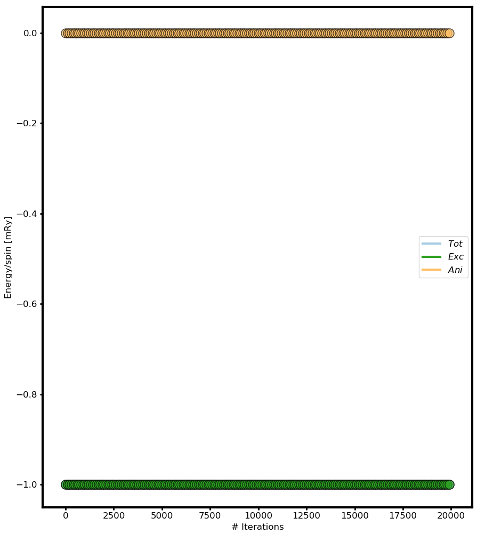
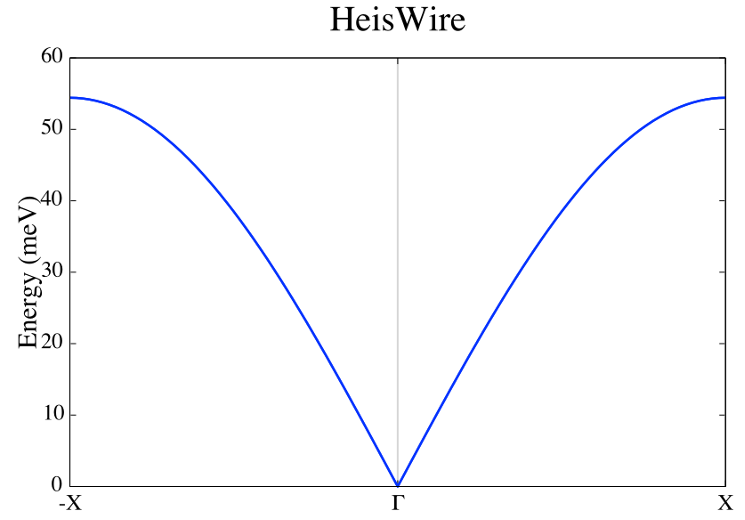

Magnon spectra and noncollinear magnetism
=========================================

Tutorial 1: Fe in bcc and fcc crystal structures
------------------------------------------------

Collinear magnon spectra and influence of uniaxial anisotropy
^^^^^^^^^^^^^^^^^^^^^^^^^^^^^^^^^^^^^^^^^^^^^^^^^^^^^^^^^^^^^

This example shows how to calculate the spin wave spectrum of the standard examples Fe bcc and Fe fcc and to understand the influence of the number of atoms per unit cell on the spectra together with the influence of the uniaxial anisotropy.

Crystal & magnetic structure
^^^^^^^^^^^^^^^^^^^^^^^^^^^^

Using the lines below with the indicated files, the crystal and magnetic structure are readily available, so that an Fe bcc system is created.

::

  simid bccFe100
  ncell     10        10       10                 System size
  BC        P         P         P                 Boundary conditions (0=vacuum, P=periodic)
  cell      1.00000   0.00000   0.00000
            0.00000   1.00000   0.00000
            0.00000   0.00000   1.00000
  Sym       0      Symmetry of lattice (0 for no, 1 for cubic, 2 for 2d cubic, 3 for hexagonal)
  posfile    ./posfile
  momfile    ./momfile
  exchange   ./jfile
  anisotropy ./kfile
  do_prnstruct 2          Flag to print lattice structure (0=off/1=on/2=print only coordinates)

.. figure:: figures/tutorial1/fig1.png

Fig 1. Lattice and magnetic texture.

Thermalizing the system
^^^^^^^^^^^^^^^^^^^^^^^

Using the lines below, the systems is driven to the ground state.

::

  ip_mode   M
  ip_mcanneal 1
  10000 0.001 1.00e-16 0.95
  
  mode      M
  Temp      0.001          K                      Temperature of the system
  hfield    0.00000   0.00000   0.00000           Static H field
  mcNstep   50000                                 MC steps

.. figure:: figures/tutorial1/fig2.png

Fig 2. Energy versus number of iterations.

Spin wave spectrum
^^^^^^^^^^^^^^^^^^
We calculate the spin wave spectrum (in this case, a collinear adiabatic magnon spectra (AMS)) at the list of Q points ``qfile``. Use ``qmaker`` script.

::

  do_ams Y                         Collinear Adiabatic magnon spectra
  qpoints D                        Direct coordinates
  qfile ./qfile                    Path along the high symmetry points in the reciprocal space

**The first Brilluoin zone of a body centered cubic lattice**

.. figure:: figures/tutorial1/fig3.png

Fig 3. Primitive and reciprocal lattice vectors in bcc.

.. figure:: figures/tutorial1/fig4.png

Fig 4. BCC 1st Brilluoin zone.

.. figure:: figures/tutorial1/fig5.png

Fig 5. High symmetry points.

Plotting the spectrum
^^^^^^^^^^^^^^^^^^^^^

Use the UppASD graphical interface (ASDGUI) or the script enclosed in this course (plotsqw_course). Use option 2.

.. figure:: figures/tutorial1/fig6.png

Fig 6. Adiabatic magnon spectra.

Questions and exercises:
^^^^^^^^^^^^^^^^^^^^^^^^

1. Does the spectra follow the analytical expression?
2. Why the spectra is shift it up? 
3. Plot the spectra without the gap around the center zone.
4. Why there are two branches, 1 acoustic and 1 optical?
5. Plot the spectrum for Fe fcc. Why now there is just 1 branch? Is it following the analytical expression?

Fig 7. Adiabatic magnon spectra of Fe FCC.

Tutorial 2
==========
 
FM Heisenberg nearest-neighbour spin chain
------------------------------------------

Collinear adiabatic magnon spectra and S(q,w)
^^^^
The following tutorial shows every step necessary to calculate spin wave spectrum and S(q,w) through the simple example of the ferromagnetic spin chain. Notice that the classical magnetic ground state of the Hamiltonian defined in this example is where every spin have the same direction, the direction is arbitrary since the Hamiltonian is isotropic.

Crystal & magnetic structure
^^^^

Using the lines below with the indicated files, the crystal and magnetic structure are readily available, so that an 1D Heisenberg chain is created.
::

  simid     HeisWire                              System name
  ncell     1         1         100               System size (in terms of unit cells)
  BC        0         0         P                 Boundary conditions (0=vacuum,P=periodic)
  cell      1.00000   0.00000   0.00000
           0.00000   1.00000   0.00000
           0.00000   0.00000   1.00000
  Sym       1                                     Symmetry of lattice (0 for no, 1 for cubic, 2 for 2d cubic, 3 for hexagonal)  
  
  posfile   ./posfile                             Position file
  exchange  ./jfile                               Exchange file
  momfile   ./momfile                             Moment file
  do_prnstruct 1          Flag to print lattice structure (0=off/1=on/2=print only coordinates)

.. figure:: figures/tutorial2/fig1.png

Fig 1. Crystal and magnetic texture.

Spin dynamics
^^^^

Using the lines below, the systems is driven to the ground state by spin dynamics.
::

  Mensemble 1                                     Number of samples in ensemble averaging
  Initmag   3                                     (1=random, 2=cone, 3=spec., 4=file)
  
  ip_mode   S                                     Initial phase parameters
  ip_nphase 1
  20000 1.0e-3 1e-16 4.0
  
  mode      S                                     S=SD, M=MC
  temp      1.0e-3                                Measurement phase parameters
  damping   0.0010                                --
  Nstep     40000                                 --
  timestep  1.000e-15                             --

Fig 2. Energy versus number of iterations.

Spin wave spectrum
^^^^

We calculate the spin wave spectrum (in this case, a collinear adiabatic magnon spectra) at the list of Q points (qfile). Use qmaker script.

::

  do_ams Y                         Collinear Adiabatic magnon spectra
  do_magdos N                      Generate magnon density of states
  
  qpoints F                        Flag for q-point generation (F=file,A=automatic,C=full cell)
  qfile   ./qfile                  Path along the high symmetry points in the reciprocal space

**The first Brilluoin zone of a simple cubic lattice**

.. figure:: figures/tutorial2/fig3.png

Fig 3. Primitive and reciprocal lattice vectors in bcc.

Fig 4. BCC 1st Brilluoin zone.

.. figure:: figures/tutorial2/fig5.png

Fig 5. High symmetry points.

Plotting adiabatic magnon spectrum in the framework of Linear Spin Wave Theory
^^^^
Use the UppASD graphical interface (ASDGUI) or the script enclosed in this course (plotsqw_course). Use option 2. File to print out “ams.HeisWire.out”.

.. figure:: figures/tutorial2/fig6.png

Fig 6. Adiabatic magnon spectra.

Plotting S(q,w)
^^^^
Use the UppASD graphical interface (ASDGUI) or the script enclosed in this course (plotsqw_course). Use option 1 for S(q,w) or option 3 for S(q,w) with AMS. File to print out “sqw.HeisWire.out”.

::

  do_sc Q           Measure spin correlation
  sc_window_fun  2  Choice of FFT window function (1=box, 2=Hann, 3=Hamming, 4=Blackman-Harris)
  sc_nstep 5000     Number of steps to sample
  sc_step 8        Number of time steps between each sampling

.. figure:: figures/tutorial2/fig7.png

Fig 7. Structure factor together with AMS.

Questions and exercises:
^^^^

1. Does it follows the analytical expression predicted by Linear Spin Wave Theory?

Tutorial 3
==========
 
AFM Heisenberg nearest-neighbour spin chain
-------------------------------------------

Collinear adiabatic magnon spectra and S(q,w)
^^^^

The following tutorial shows every step necessary to calculate spin wave spectrum and S(q,w) through the simple example of the antiferromagnetic spin chain. Notice that AMS in this case does not work for the primitive unit cell and it is necessary to a magnetic supercell 2x1x1 of the crystal cell and define both spin direction in the supercell.

Crystal & magnetic structure
^^^^

Using the lines below with the indicated files, the crystal and magnetic structure are readily available, so that an 1D AFM Heisenberg chain is created. Have a look to posfile and momfile.

::

  simid     HeisWire
  ncell     1         1         100               System size
  BC        0         0         P                 Boundary conditions (0=vacuum,P=periodic)
  cell      1.00000   0.00000   0.00000
             0.00000   1.00000   0.00000
            0.00000   0.00000   2.000000
  Sym       1                                     Symmetry of lattice (0 for no, 1 for cubic, 2 for 2d cubic, 3 for hexagonal)
  
  posfile   ./posfile
  exchange  ./jfile
  momfile   ./momfile
  do_prnstruct 1                                 Print lattice structure (0=no, 1=yes)
  maptype   2                                    1=cartessian coordinates, 2=Direct coordinates

Fig 1. Crystal and magnetic texture.

Spin dynamics
^^^^

Using the lines below, the systems is driven to the ground state by spin dynamics.

::

  ip_mode   S                                     Initial phase parameters
  ip_nphase 1
  20000 1.0e-3 1e-16 4.0
  
  mode      S                                     S=SD, M=MC
  temp      1.0e-3                                Measurement phase parameters
  damping   0.0010                                --
  Nstep     45000                                 --
  timestep  1.000e-15                             --

.. figure:: figures/tutorial3/fig2.png

Fig 2. Energy versus number of iterations.

Spin wave spectrum
^^^^

We calculate the spin wave spectrum (in this case, a collinear adiabatic magnon spectra) at the list of Q points (qfile). Use qmaker script.

::

  do_ams Y                      Collinear Adiabatic magnon spectra
  do_magdos N                   Generate magnon density of states
  
  qpoints D                     Flag q-point generation(F=file,A=automa.,C=full cell,D=external
                                file with direct coordinates)
  qfile   ./qfile               Path along the high symmetry points in the reciprocal space

**The first Brilluoin zone of a simple cubic lattice**

Fig 3. Primitive and reciprocal lattice vectors in bcc.

Fig 4. BCC 1st Brilluoin zone.

.. figure:: figures/tutorial3/fig5.png

Fig 5. High symmetry points.

Plotting adiabatic magnon spectrum in the framework of Linear Spin Wave Theory
^^^^

Use the UppASD graphical interface (ASDGUI) or the script enclosed in this course (plotsqw_course). Use option 2. File to print out “ams.HeisWire.out”.

1. Use only the primitive cell.

Fig 6. Adiabatic magnon spectra.

2. Use the magnetic supercell 2x1x1 of the crystal cell

Fig 7. Adiabatic magnon spectra.

Plotting S(q,w)
^^^^

Use the UppASD graphical interface (ASDGUI) or the script enclosed in this course (plotsqw_course). Use option 1 for S(q,w) or option 3 for S(q,w) with AMS. File to print out “sqw.HeisWire.out”.

:

  do_sc Q           Measure spin correlation
  sc_window_fun  2  Choice of FFT window function (1=box, 2=Hann, 3=Hamming, 4=Blackman-Harris)
  sc_nstep 3000     Number of steps to sample
  sc_step  15       Number of time steps between each sampling

.. figure:: figures/tutorial3/fig8.png

Fig 8. Structure factor with AMS.

Questions and exercises:
^^^^

1. Does it follows the analytical expression predicted by Linear Spin Wave Theory? Why is linear around the center zone?
2. Calculate analytically the Energy/spin and show it is the same as the numerical result.

